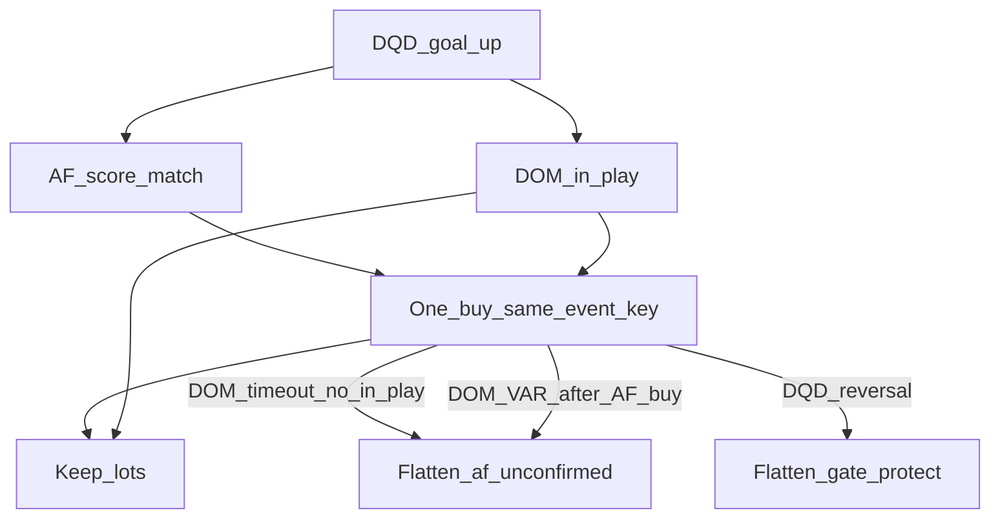

# Design: AF ∨ DOM or-gate (**rejected, not implemented**)

Status: **否决、不实现.** Live strategy is same-tick **DOM `in_play` ∧ AF `score_match`** buy, then stop; DQD reversal restarts a 5s trail and flattens on **AF∨DOM `score_match`**. Do not code the buy-side or-gate below.  
Window used for the overnight numbers: 2026-08-22 00:00–09:30 CST.

## Decision

- **Entry:** first of `AF score_match` or `DOM in_play` buys once per `event_key`.
- **Exit (chosen):** if the buy was AF-sourced and DOM never reaches `in_play` in the 150s gate window, flatten that goal’s pitch-gate lots + rest. DQD reversal still uses `QUOTE_GATE_PROTECT_S` (default 300s).
- **VAR after an AF buy:** flatten immediately (DOM explicit reject), do not wait 150s.
- **New goal `superseded_by_new_goal`:** do **not** flatten the previous AF lots (same as today: only revoke undrained buys).

Overnight cost of the DOM-timeout flatten: of 17 AF-only hits, **13 were real goals** (Nami score already matched, empty pop-box, DOM stayed `unclear`). Those would be sold at t+150s. The 3 AF phantom goals that DQD later reversed are already covered by gate-protect flatten.

## Flow

## Implementation notes (when coding)

Shared buy: `_GateSession` in `scripts/pitch_gate.py` gains `buy_source` (`af` | `dom`) and `dom_in_play`. Existing `buy_emitted` still means one knife per goal.

**AF → buy:** `scripts/af_observe.py` on first `score_match is True` callbacks the coordinator (do not scrape jsonl). Require `ok`, oriented AF score == expected DQD score, not `var_seen`, not `buy_emitted`. Emit the same drain path as DOM `in_play` (`quote_lib._drain_pitch_gate`) with `trade_context.pitch_gate=true` and `gate_source=af`.

**DOM → buy or confirm:** current `in_play` path unchanged. If `buy_source=af` already, only set `dom_in_play`; no second BUY.

**DOM timeout flatten:** `_finish_session(status=timeout)` with `buy_source==af` and never DOM `in_play` drains `af_unconfirmed`. Executor flattens **this `event_key` + `pitch_gate` lots/rest only** (not all `open_for_match`). Reason: `af_unconfirmed_dom_timeout`.

**Reversal:** leave `cancel_match` + `gate_protect_reversal` as-is.

**Flag:** `QUOTE_GATE_OR_AF=1` default on when implemented; `0` restores DOM-only entry.

## Tests to add later

- AF first, then DOM `in_play` → one buy, no flatten
- AF first, DOM timeout → one buy + flatten that `event_key`
- DOM first, AF later → one buy, AF ignored
- AF buy then VAR → immediate flatten
- AF buy then DQD reversal → protect flatten only (no double-flatten failure)
- `superseded_by_new_goal` does not flatten old AF lots

Board: show `buy_source=af|dom`. SKILL / README / reference must say celebration-blank true goals get flattened at 150s.

## Files to touch later

- `scripts/af_observe.py` — first-match callback
- `scripts/pitch_gate.py` — or-gate, `buy_source`, timeout/VAR signal
- `scripts/quote_lib.py` — drain `af_unconfirmed`
- `scripts/trade_executor.py` — flatten by `event_key` + cancel rest
- `scripts/score_reversal.py` — lots already have `event_key` / `pitch_gate`

## Overnight disagreement snapshot (context)

| Bucket | N | Note |
|---|---|---|
| Both hit | 116 | AF usually earlier |
| AF only | 17 | 13 empty pop-box; 4 DOM score still old; 3 later DQD-reversed |
| DOM only | 9 | 7 no AF samples (early window); 2 AF fixture unresolved |
| Both miss | 21 | 15 are DQD reversals (correct to stay out) |
| Dual false confirm | 1 | The Strongest 2-0, then DQD reverse |
